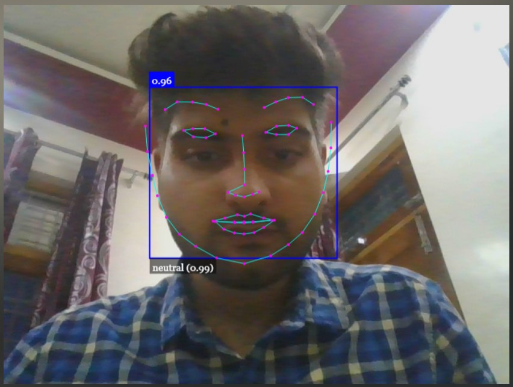

#expressions.github.io
# Face Recognition
This web app uses [Face API](https://justadudewhohacks.github.io/face-api.js/docs/index.html), which is a JavaScript API for real-time face detection. This also implements facial landmark detection, along with Face Expression Recognition (for example: sad, angry, happy, surprised).
## Installation
* **[Download and install node.js](https://nodejs.org/en/)**
* **Next install NPM's live server**
```bash
npm install -g live-server
```
**We may also install live-server in VSCode by going to extensions, searching for live
server and installing the same.**
* **Clone this repository and open the same in VSCode**

## About
The HTML page **index.html** uses the Face API to detect faces and expressions. However, since opening a webcam may require some privacy, a startup page **Start.html** has been created so that one can decide when they are ready to use their webcam device.

## Usage
Open the folder in vscode. Right-Click on **Start.html** and choose *Open in live server*.
Alternatively, we can do 
```bash
cd /project-directory
live-server 
```
When you're ready to turn your web camera on for real-time Face Recognition, Click on the orange button at the bottom. 
A square box on top of the image detects the face , the expression on the bottom and a number on the top of the face represents the probability that the object is in fact a face.


